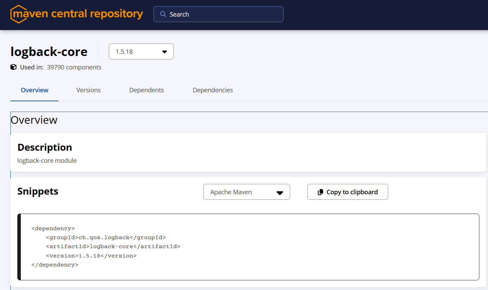

# Progetto SSDLC - Secure Software Development Life Cycle

**Lorenzo Ferrari**  
Repository: [Progetto SSDLC](https://github.com/Lore-Ferra/Progetto_SSDLC_Ferrari_Lorenzo)  
Progetto base: [onlinebookstore (Java)](https://github.com/shashirajraja/onlinebookstore)

## Introduzione

Questo progetto ha l’obiettivo di simulare un processo di sviluppo sicuro (SSDLC) in un ambiente DevSecOps moderno, integrando strumenti per l’automazione CI/CD, l’analisi statica del codice (SAST) e l’analisi delle dipendenze (SCA).  
L’intero sistema è containerizzato tramite Docker e utilizza Jenkins come orchestratore per garantire qualità, sicurezza e tracciabilità durante ogni fase dello sviluppo.
Includendo controlli di qualità, sicurezza e automazione delle build con strumenti open-source.

## Tecnologie Utilizzate

- Jenkins (automazione CI/CD)
- Docker & Docker Compose (ambiente containerizzato)
- SonarQube (analisi statica del codice)
- OWASP Dependency Check (analisi librerie di terze parti)
- PostgreSQL (per SonarQube)
- Maven (build Java)
- Jacoco (code coverage)
- GitHub (repository di versione)
- JUnit + Mockito (test)

## Servizi Disponibili

- Jenkins: http://localhost:8080  
- SonarQube: http://localhost:9001

## Architettura dell'Ambiente

Tutti gli strumenti sono eseguiti tramite container **Docker**, aumentando l’isolamento, la riproducibilità e la portabilità.

Container coinvolti:
- Jenkins
- SonarQube
- PostgreSQL (database per SonarQube)

## Pipeline CI/CD

La pipeline è composta dai seguenti stage:

- **Stage 1 – Checkout**: clonazione del repository e setup iniziale
- **Stage 2 – Build e test**: compilazione tramite Maven e verifica del codice
- **Stage 3 – Analisi SAST**: scansione con SonarQube
- **Stage 4 – Analisi SCA**: esecuzione di OWASP Dependency Check
- **Stage 5 – Verifica Quality Gate**: blocco della pipeline in caso di violazioni
- **Stage 6 – Archiviazione artefatti**
- **Stage 7 – Notifiche Discord (simulazione)**

1. **Clonazione del repository**  
   ```groovy
    stage('Checkout') {
        steps {
            echo "Cloning the repository..."
            checkout scm // Clona il repository Git collegato al job Jenkins
        }
    }
   ```

2. **Build e test**  
   ```groovy
   stage('Build') {
        steps {
            echo "Building the project with Maven..."
            dir('repo_git/onlinebookstore') {
                sh 'mvn clean verify' // Pulisce, compila e testa il progetto
            }
        }
    }
   ```

3. **Analisi statica del codice (SAST)**  
   ```groovy
   stage('SonarQube Analysis') {
        steps {
            dir('repo_git/onlinebookstore') {
                withCredentials([string(credentialsId: 'sonarqube-token', variable: 'SONAR_TOKEN')]) {
                    withSonarQubeEnv("${env.SONARQUBE_ENV}") {
                        sh 'mvn sonar:sonar -Dsonar.token=$SONAR_TOKEN' // Avvia la scansione SonarQube con token
                        sh 'cat target/sonar/report-task.txt || true'   // Mostra info su task Sonar, utile per debug
                    }
                }
            }
        }
    }
   ```
> L'opzione `-Dsonar.token=$SONAR_TOKEN` viene usata per autenticarsi rapidamente a SonarQube, evitando rallentamenti o errori durante la scansione in ambienti CI.


4. **Analisi delle dipendenze (SCA)**  
   ```groovy
   stage('SCA - OWASP Dependency Check') {
        steps {
            dir('repo_git/onlinebookstore') {
                echo "Running Software Composition Analysis with OWASP Dependency Check..."
                sh 'mvn org.owasp:dependency-check-maven:check -Dnvd.api.key=$NVD_API_KEY'
            }
        }
    }
   ```
   > L’API key del NVD è richiesta per scaricare le ultime vulnerabilità da parte di OWASP Dependency Check.

5. **Controllo dei Quality Gate**  
   ```groovy
   stage('Quality Gate') {
        steps {
            script {
                echo "Aspetto 15 secondi per permettere a SonarQube di completare l'analisi..."
                sleep time: 15, unit: 'SECONDS' // Attesa prima di interrogare SonarQube
            }
            timeout(time: 5, unit: 'MINUTES') {
                waitForQualityGate abortPipeline: true // Verifica risultato dell'analisi: se fallisce, termina la pipeline
            }
        }
    }
   ```

6. **Archiviazione degli artefatti**  
   ```groovy
   stage('Archiviazione Artefatti') {
        steps {
            archiveArtifacts artifacts: 'repo_git/onlinebookstore/target/*.war', fingerprint: true
            archiveArtifacts artifacts: 'repo_git/onlinebookstore/target/dependency-check-report.*', fingerprint: true
        }
    }
   ```
   > Salva il file .war generato e il report .html/.xml di Dependency Check come artefatti del job.

7. **Notifiche (simulazione)**  
   ```groovy
    def sendDiscordMessage(String content) {
        withCredentials([string(credentialsId: 'DISCORD_WEBHOOK_URL', variable: 'WEBHOOK')]) {
            def msg = [
                username: "Jenkins Bot",
                content: content
            ]

            httpRequest httpMode: 'POST',
                        contentType: 'APPLICATION_JSON',
                        url: "${WEBHOOK}",
                        requestBody: groovy.json.JsonOutput.toJson(msg)
        }
    }
    post {
        success {
            script {
                def msg = """
    :white_check_mark: *Build riuscita!*

    **Progetto**: `onlinebookstore`
    **Branch**: `${env.GIT_BRANCH ?: 'sconosciuto'}`
    **Build**: [#${env.BUILD_NUMBER}](${env.BUILD_URL ?: 'URL non disponibile'})

    Tutte le scansioni di sicurezza sono state superate con successo. :lock:
    """
                sendDiscordMessage(msg.trim())
            }
        }
        failure {
            script {
                def msg = """
    :x: *Build fallita!*

    **Progetto**: `onlinebookstore`
    **Branch**: `${env.GIT_BRANCH ?: 'sconosciuto'}`
    **Build**: [#${env.BUILD_NUMBER}](${env.BUILD_URL ?: 'URL non disponibile'})

    Sono stati rilevati errori nella pipeline o nelle scansioni di sicurezza. :warning:
    """
                sendDiscordMessage(msg.trim())
            }
        }
        always {
            echo "Pipeline completata. Notifica inviata."
        }
    }
   ```


## Configurazioni Principali

### Jenkins
- Installato come container Docker.
- Plugin: Git, Maven, SonarQube Scanner, OWASP Dependency Check, Pipeline.
- Pipeline definita tramite `Jenkinsfile` nel repository.


### SonarQube
- Container Docker con backend PostgreSQL.
- Progetto configurato manualmente.
- Quality Gate **standard** di SonarQube utilizzato senza modifiche, con soglie predefinite su vulnerabilità, code smell e coverage.
- Scanner integrato nella pipeline Jenkins tramite token di accesso.


## Modifiche alle Dipendenze per Motivi di Sicurezza

Durante la scansione SCA, sono state rilevate vulnerabilità critiche o ad alta severità in alcune dipendenze. Sono state eseguite modifiche per garantire la conformità ai quality gate.

| Libreria               | Versione originale | Nuova versione | Vulnerabilità rilevate         | Azione     | Motivazione della modifica                                                                                                 |
| ---------------------- | ------------------ | -------------- | ------------------------------ | ---------- | -------------------------------------------------------------------------------------------------------------------------- |
| `mysql-connector-java` | 8.0.28             | 9.3.0          | CVE-2021-2471                  | Aggiornata | La versione 8.0.28 presenta vulnerabilità note, inclusa una che consente accesso non autorizzato ai metadati del database. |
| `postgresql`           | 42.3.7             | 42.7.7         | CVE-2022-21724                 | Aggiornata | La versione 42.3.7 era affetta da una vulnerabilità che poteva portare a DoS in condizioni particolari.                    |
| `javax.servlet-api`    | 3.1.0              | 4.0.1          | CVE-2020-11996                 | Aggiornata | La versione 3.1.0 soffriva di un potenziale DoS tramite gestione asincrona errata.                                         |
| `logback-core`         | 1.4.14             | 1.5.18         | CVE-2024-12798, CVE-2024-12801 | Aggiornata | La versione 1.4.14 permetteva l'esecuzione di codice via configurazione maliziosa e attacchi SSRF.                         |
| `junit-jupiter`        | Non presente       | 5.10.2         | -                              | Aggiunta   | Aggiunta per supporto a JUnit 5 e test moderni. Nessuna vulnerabilità nota.                                                |
| `mockito-core`         | Non presente       | 5.12.0         | -                              | Aggiunta   | Necessaria per unit test con mocking. Versione stabile e aggiornata.                                                       |
| `mockito-inline`       | Non presente       | 5.2.0          | -                              | Aggiunta   | Aggiunta per supporto al mocking di metodi statici. Nessuna CVE nota.                                                      |
| `h2`                   | Non presente       | 2.2.224        | -                              | Aggiunta   | Usata nei test come database in-memory. Ultima versione stabile, priva di vulnerabilità note.                              |

Tutte le modifiche sono state verificate tramite build Jenkins e analisi statica con SonarQube. Dopo ogni aggiornamento, è stato eseguito un nuovo ciclo di test e controllo dei Quality Gate.




## Risultati delle Scansioni

Durante l'esecuzione della pipeline CI/CD sono stati rilevati i seguenti problemi tramite SonarQube:

### Software Quality

- **Security:** 8 vulnerabilità
- **Reliability (bug):** 44 problemi
- **Maintainability (code smell):** 114 problemi

### Gravità rilevata (Severity)

- **Blocker:** 10
- **High:** 44
- **Medium:** 82
- **Low:** 29
- **Info:** 1

### Altri indicatori

- **Duplicazione del codice:** 10.2%
- **Code Coverage:** 0.0%
- **Security Hotspot:** 59


### Situazione finale
Dopo l’aggiunta di test (JUnit + Jacoco), refactoring e aggiornamento delle dipendenze:
- Nessuna vulnerabilità o bug rilevati.
- Tutti i **Security Hotspot** sono stati identificati e risolti.
- Coverage aumentata a **86.8%**
- Duplicazione codice ridotta a **1.3%**
- Tutti i Quality Gate superati con valutazione **A** in ogni categoria.


## Analisi delle Vulnerabilità

L'analisi del progetto ha evidenziato diverse vulnerabilità di sicurezza e di qualità del codice, individuate grazie alla pipeline automatizzata con SonarQube e OWASP Dependency Check.

Una documentazione sulle vulnerabilità risolte è disponibile nel file dedicato:  
[Report Vulnerabilità](./Vulnerabilità.md)

Al suo interno sono incluse vulnerabilità, ciascuna documentata con:

- Descrizione tecnica dettagliata (es. uso errato di System.out, uso di librerie obsolete)
- Classificazione OWASP TOP 10 (se applicabile), per mappare la vulnerabilità a un rischio riconosciuto
- Gravità e impatti sul sistema (es. perdita di log, visibilità ridotta, instabilità)
- Fix suggeriti o applicati, con codice prima/dopo
- Confronto diretto tra la versione vulnerabile e quella corretta, evidenziando il superamento del Quality Gate


## Repository del Codice Sorgente Analizzato

Il progetto scelto è un’applicazione Java:  
🔗 [onlinebookstore](https://github.com/shashirajraja/onlinebookstore)


## Conclusioni

Questo progetto dimostra come integrare con successo pratiche di sviluppo sicuro all’interno di un processo DevOps attraverso strumenti open-source e automatizzazione CI/CD.  
In particolare, evidenzia:
- L’importanza del controllo continuo del codice e delle dipendenze.
- L’efficacia dell’automazione nella rilevazione e mitigazione di vulnerabilità.
- Il valore dell’uso di container per ambienti consistenti e portabili.