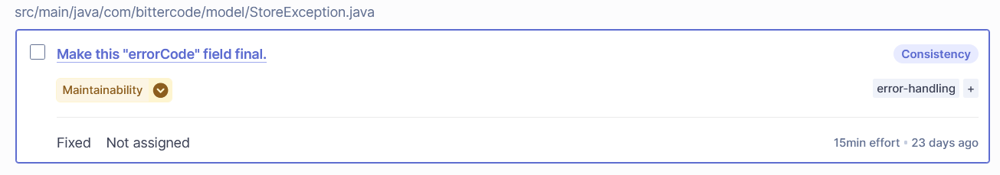
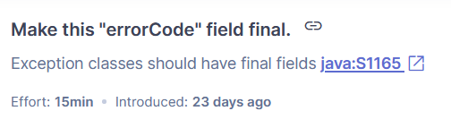
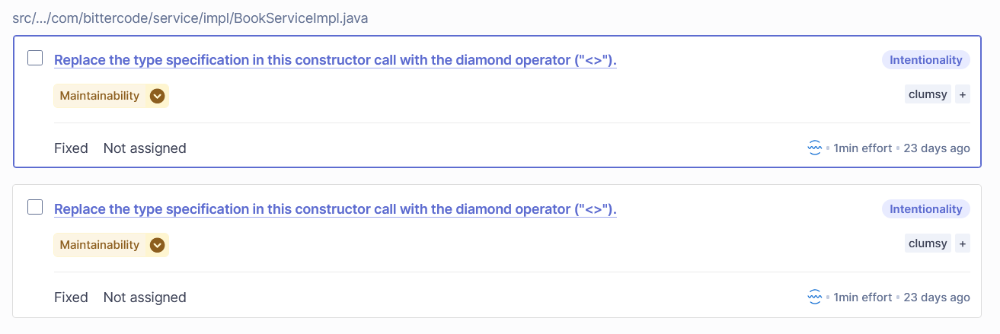
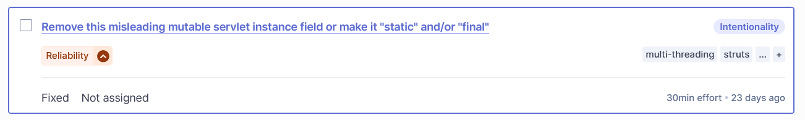
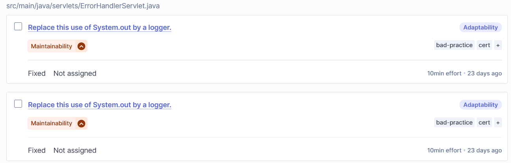
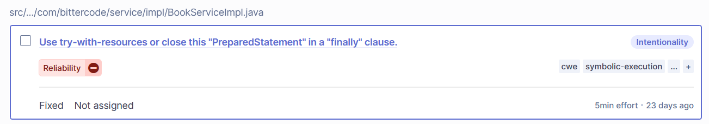

### Vulnerabilità 1 - (Low)

I campi errorCode, errorMessage e statusCode, nella classe StoreException, sono stati resi final per impedirne la modifica dopo l’inizializzazione.



**Prima:**

```java
private String errorCode;
private String errorMessage;
private int statusCode;
```

**Dopo:**

```java
private final String errorCode;
private final String errorMessage;
private final int statusCode;
```

### Motivazione

Garantire l’immutabilità dei campi legati agli errori evita modifiche indesiderate durante il ciclo di vita dell’oggetto.  
In contesti multi-threaded o non controllati, i setter avrebbero potuto essere sfruttati per alterare informazioni critiche come il messaggio o il codice di errore.

### Vulnerabilità Mitigata

- **Tipo:** Modificabilità dello stato interno di oggetti di errore
- **Descrizione:** La presenza di metodi setter espone la classe a modifiche runtime non desiderate, con il rischio di:
  - generare log incoerenti
  - falsificare i messaggi di errore
  - introdurre comportamenti imprevedibili

### Classificazione OWASP

- **Categoria:** A05 – Security Misconfiguration
- **Gravità:** Bassa (Low)
- **Rischio:** Esporre strutture critiche a configurazioni deboli o modificabili può portare a comportamenti imprevisti e vulnerabilità sfruttabili.



### Benefici della Correzione

- Migliore **integrità** e **affidabilità** dell’oggetto StoreException
- Prevenzione di **manipolazioni a runtime**
- Codice più sicuro, **chiaro** e conforme alle **best practice DevSecOps**
- Maggiore **tracciabilità** e **coerenza nei log di errore**

## Vulnerabilità 2 – (Low)

In alcune parti del codice, veniva utilizzata una dichiarazione esplicita del tipo generico nel costruttore di `ArrayList`.



**Prima:**

```java
List<Book> books = new ArrayList<Book>();
```

**Dopo:**

```java
List<Book> books = new ArrayList<>();
```

### Motivazione

L’utilizzo del diamond operator (`<>`) introdotto in Java 7 evita la duplicazione ridondante del tipo e migliora:

- **leggibilità** del codice
- **manutenibilità**
- **sicurezza evolutiva** del codice (se cambia il tipo, si modifica una sola volta)
- **conformità** con le best practice di sviluppo moderne

### Classificazione OWASP

- **Categoria:** Non direttamente classificabile in OWASP Top 10, ma associabile a:
  - A06 – Vulnerable and Outdated Components (utilizzo di pattern non aggiornati)
- **Gravità:** Bassa (Low)
- **Rischio:** Nessun rischio diretto di sicurezza, ma può contribuire a una base di codice obsoleta e fragile, più esposta a errori futuri.

### Benefici della correzione

- Migliore **conformità** agli standard Java
- Codice più **chiaro** e privo di duplicazioni inutili
- Riduce possibilità di **refusi** durante refactoring

### Vulnerabilità 3 – (Medium)

In alcune servlet (es. `CartServlet`) veniva dichiarato un campo **di istanza mutabile** per una dipendenza condivisa (`BookService`), violando le best practice per la gestione dei componenti in ambienti multithread come le servlet.



**Prima:**

```java
BookService bookService = new BookServiceImpl();
```

**Dopo:**

```java
private static final BookService bookService = new BookServiceImpl();
```

#### Motivazione

Le servlet sono **singleton gestiti dal container**: un solo oggetto `CartServlet` serve molteplici richieste concorrenti. Usare campi **non statici e non finali** può:

- Indurre in errore (sembrano specifici per richiesta, ma non lo sono)
- Essere fonte di bug se accidentalmente mutati
- Creare problemi di thread safety in caso di modifiche future

La modifica a `static final` garantisce che la dipendenza sia:

- **immutabile**
- **unica e condivisa**
- rispetti le **best practice**

#### Classificazione OWASP

- **Categoria:**
  - A05 – Security Misconfiguration
  - A04 – Insecure Design (per cattiva progettazione dello scope degli oggetti)
- **Gravità:** Media (Medium)
- **Rischio:** Medio. Anche se non introduce direttamente vulnerabilità exploitabili, può causare condizioni di concorrenza o instabilità se il campo viene mutato da più thread.

#### Benefici della correzione

- Conforme ai **principi** di **progettazione sicura** per servlet
- Miglioramento della **thread safety**
- Rendere il codice più **leggibile** e **testabile**
- Evitare **ambiguità semantica** sullo scope del campo
- **Agevolare** strumenti di analisi statica come **SonarQube**

### Vulnerabilità 4 – (Medium)

In alcune servlet (es. `CustomerRegisterServlet`, `CartServlet`) mancava l'annotazione `@Override` prima della dichiarazione del metodo `service(...)`.

**Prima:**

```java
public void service(HttpServletRequest req, HttpServletResponse res) throws IOException, ServletException {
```

**Dopo:**

```java
@Override
public void service(HttpServletRequest req, HttpServletResponse res) throws IOException, ServletException {
```

#### Motivazione

L'annotazione `@Override` è essenziale per garantire che un metodo stia effettivamente sovrascrivendo una definizione nella superclasse (`HttpServlet`). La sua assenza può causare:

- **Errori silenziosi**, ad esempio: sbagliata firma del metodo (nome, parametri o tipo di ritorno)
- **Comportamenti inattesi** in fase di esecuzione, il metodo definito non viene mai invocato
- **Difficoltà** nell'uso di strumenti di analisi statica o refactoring automatico

#### Classificazione OWASP

- **Categoria:**
  - A06 – Vulnerable and Outdated Components (cattivo uso delle funzionalità del linguaggio)
- **Gravità:** Media (Medium)
- **Rischio:** Potenziale malfunzionamento dell’applicazione in caso di firma errata, non rilevata a compilazione. Non è una falla di sicurezza diretta, ma può causare instabilità o bug difficili da diagnosticare.

#### Benefici della correzione

- Evitare **errori di overriding silenziosi**
- Migliorare **leggibilità** e **manutenibilità** del codice
- Favorire integrazione con strumenti come **SonarQube**, **IDE**, **CI/CD**
- Rendere comportamento della servlet **più prevedibile e corretto**


## Vulnerabilità 5 – (Medium)

In alcune servlet, come `ErrorHandlerServlet`, veniva utilizzato `System.out.println(...)` per la stampa di messaggi diagnostici e di errore.



**Prima:**

```java
System.out.println("======ERROR TRIGGERED========");
System.out.println("Servlet Name: " + servletName);
System.out.println("Request URI: " + requestUri);
System.out.println("Status Code: " + statusCode);
System.out.println("Error Code: " + errorCode);
System.out.println("Error Message: " + errorMessage);
System.out.println("=============================");
```

**Dopo:**

```java
if (logger.isLoggable(Level.INFO)) {
    logger.info("======ERROR TRIGGERED========");
    logger.info(String.format("Servlet Name: %s", servletName));
    logger.info(String.format("Request URI: %s", requestUri));
    logger.info(String.format("Status Code: %d", statusCode));
    logger.info(String.format("Error Code: %s", errorCode));
    logger.info(String.format("Error Message: %s", errorMessage));
    logger.info("=============================");
}
```

### Motivazione

L’utilizzo diretto di `System.out` in ambienti enterprise o concorrenti è considerato una cattiva pratica perché:

- Non è configurabile (non si può disattivare, filtrare o reindirizzare facilmente)
- Non fornisce livelli di severità (INFO, WARNING, SEVERE...)
- Non è thread-safe
- Compromette la leggibilità dei log in produzione
- Rende difficile l’integrazione con strumenti di monitoraggio e log analysis (es. ELK, Splunk)

L’uso del logger standard (`java.util.logging.Logger`) permette, invece, di:

- Distinguere tra log informativi, di errore o di debug
- Centralizzare la configurazione dei log
- Rendere il codice più pulito e professionale
- Evitare sprechi computazionali grazie al controllo `logger.isLoggable(...)`

### Classificazione OWASP

- **Categoria:**

  - A06 – Vulnerable and Outdated Components
  - A05 – Security Misconfiguration (per ambienti non correttamente configurati alla gestione dei log)

- **Gravità:** Media (Medium)
- **Rischio:** Moderato. Non espone direttamente ad un attacco, ma può:
  - Nascondere o perdere informazioni importanti in produzione
  - Rendere più difficile il troubleshooting
  - Rendere il sistema non conforme agli standard aziendali

### Benefici della correzione

- Maggiore visibilità degli errori reali in ambienti multiutente
- Integrazione nativa con sistemi di log e APM
- Codice più professionale e pronto per la produzione
- Separazione delle responsabilità tra log e output standard

## Vulnerabilità 6 – (High)

Nel progetto era presente un’interfaccia `BookStoreConstants` utilizzata impropriamente per la dichiarazione di costanti:

**Prima:**

```java
package com.bittercode.constant;

public interface BookStoreConstants {
    public static String CONTENT_TYPE_TEXT_HTML = "text/html";
}
```

**Dopo:**

```java
package com.bittercode.constant;

public final class BookStoreConstants {
    private BookStoreConstants() {
    }

    public static final String CONTENT_TYPE_TEXT_HTML = "text/html";
}

```

### Motivazione

Utilizzare un’interfaccia per definire costanti (`constant interface pattern`) è considerato un **antipattern** in Java per le seguenti ragioni:

- Viola l’incapsulamento e la responsabilità singola di un’interfaccia
- Espone dettagli implementativi a tutte le classi che la "implementano"
- Aggiunge vincoli inutili all’ereditarietà (le classi diventano legate a quell’interfaccia)
- È una pratica deprecata secondo gli standard Java (vedi _Effective Java_ di Joshua Bloch)

La soluzione corretta è spostare le costanti in una **classe `final` con costruttore privato**, impedendone l’istanza e rispettando il principio di responsabilità singola.

### Classificazione OWASP

- **Categoria:**

  - A06 – Vulnerable and Outdated Components
  - A07 – Identification and Authentication Failures _(indirettamente, per perdita di chiarezza nei componenti)_

- **Gravità:** Alta (High)

- **Rischio:** Elevato. Nonostante non sia una vulnerabilità sfruttabile direttamente da un attaccante, può:
  - Favorire errori strutturali nel codice
  - Compromettere la manutenibilità a lungo termine
  - Introdurre dipendenze non intenzionali tra classi
  - Impedire una gestione sicura e coerente delle costanti

### Benefici della correzione

- Codice più pulito, modulare e manutenibile
- Rimozione di dipendenze non necessarie
- Miglioramento della sicurezza e della chiarezza architetturale
- Conformità agli standard di sviluppo Java professionale

## Vulnerabilità 7 – (High)

Nel file `BookServiceImpl.java` erano presenti diverse costanti `static final` che **non rispettavano la convenzione di naming** prevista dagli standard Java e inoltre veniva utilizzato in modo scorretto `SELECT *`, racchiuso nella costante `SELECT_ALL_FROM`.

### Esempi di codice corretto e scorretto

**Prima:**

```java
private static final String SELECT_ALL_FROM = "SELECT * FROM ";
private static final String getBooksByCommaSeperatedBookIdsQuery = SELECT_ALL_FROM + BooksDBConstants.TABLE_BOOK + " ...";
private static final String updateBookQtyByIdQuery = "UPDATE ...";
```

**Dopo:**

```java
private static final String SELECT_BOOK_FIELDS = "SELECT barcode, name, author, price, quantity FROM ";
private static final String GET_BOOKS_BY_COMMA_SEPARATED_BOOK_IDS_QUERY = SELECT_BOOK_FIELDS + BooksDBConstants.TABLE_BOOK + " ...";
private static final String UPDATE_BOOK_QTY_BY_ID_QUERY = "UPDATE ...";
```

### Motivazione

#### 1. Naming delle costanti

Le costanti `static final` devono seguire il formato **SNAKE_CASE** (maiuscole con underscore), secondo la seguente espressione regolare:

`^[A-Z][A-Z0-9]*(_[A-Z0-9]+)*$`

Non rispettare questa convenzione comporta:

- Ridotta leggibilità
- Difficoltà nel distinguere costanti da variabili locali
- Warning nei tool di analisi statica come SonarQube
- Violazione degli standard Java

#### 2. Uso scorretto di `SELECT *`

Anche se racchiuso in una costante, l'uso di `SELECT *`:

- Recupera tutte le colonne, anche quelle non necessarie
- Complica la gestione del refactoring del database
- Introduce problemi di performance e ambiguità
- Espone potenzialmente più dati del necessario, violando il principio del **least privilege**

### Classificazione OWASP

- **Categoria:**

  - A06 – Vulnerable and Outdated Components
  - A05 – Security Misconfiguration _(per l'utilizzo di query SQL non ottimizzate)_

- **Gravità:** Alta (High)

- **Rischio:** Elevato. Queste pratiche compromettono la manutenibilità, leggibilità e sicurezza del codice, aumentando il rischio di:
  - Dati sovraesposti
  - Query inefficienti
  - Errori futuri difficili da diagnosticare

### Benefici della correzione

- Rispettare naming convention Java
- SQL più sicuro, esplicito e performante
- Codice più leggibile e conforme agli standard aziendali
- Riduzione dei warning nei sistemi CI/CD
- Migliore controllo sui dati restituiti dalle query

## Vulnerabilità 8 – (High)

In vari metodi della classe `BookServiceImpl` venivano utilizzati oggetti `PreparedStatement` (e in alcuni casi `ResultSet`) **senza chiusura esplicita**, causando potenziali **resource leak**. Questa violazione delle best practice può portare all'esaurimento delle connessioni al database in ambienti reali e viene segnalata da tool come **SonarQube**.



### Metodi coinvolti

- `getBookById(String bookId)`
- `getAllBooks()`
- `deleteBookById(String bookId)`
- `addBook(Book book)`
- `updateBookQtyById(String bookId, int quantity)`
- `updateBook(Book book)`

---

**Prima:**

```java
PreparedStatement ps = con.prepareStatement(UPDATE_BOOK_BY_ID_QUERY);
ps.setString(1, book.getName());
// ...
ps.executeUpdate();
```

**Dopo:**

```java
try (PreparedStatement ps = con.prepareStatement(UPDATE_BOOK_BY_ID_QUERY)) {
    ps.setString(1, book.getName());
    // ...
    ps.executeUpdate();
}
```

### Motivazione

Non utilizzare `try-with-resources` o non chiudere esplicitamente `PreparedStatement` e `ResultSet` può causare:

- Esaurimento del connection pool
- Errori runtime difficili da diagnosticare
- Comportamenti instabili in ambienti di produzione

L’uso di `try-with-resources` garantisce la **chiusura automatica** delle risorse, anche in caso di eccezioni.

### Classificazione OWASP

- **Categoria:** A06 – Vulnerable and Outdated Components
- **Gravità:** Alta (High)
- **Rischio:** Elevato. La mancata chiusura di risorse critiche può:
  - Bloccare l’accesso al database
  - Degradare le performance
  - Rendere il sistema instabile

### Benefici della correzione

- Chiusura automatica e sicura delle risorse
- Codice più robusto e professionale
- Compatibilità con Java moderno (7+)
- Prevenzione di errori gravi in ambienti di produzione
- Riduzione dei warning nei sistemi CI/CD come SonarQube

## Vulnerabilità 1 – (Security Hotspot)

### Inclusione di script esterni tramite CDN senza `integrity` e `crossorigin`

Nel codice HTML è presente la seguente inclusione:

**Prima:**
```html
<script src="https://cdn.jsdelivr.net/npm/bootstrap@4.2.1/dist/js/bootstrap.min.js"></script>
```

### Problema

Il codice include una libreria da una **fonte esterna (CDN)** senza l'utilizzo dell'attributo `integrity` (Subresource Integrity) né `crossorigin`.  
Questo espone l'applicazione a rischi nel caso in cui il CDN venga compromesso o il contenuto modificato.


### Rischi

- **Code injection** nel browser da un file JS manomesso
- Nessuna verifica dell’**integrità del contenuto** ricevuto
- Rottura di policy di sicurezza (es. **Content Security Policy** - CSP)

**Dopo:**
```html
<script
  src="https://cdn.jsdelivr.net/npm/bootstrap@4.2.1/dist/js/bootstrap.min.js"
  integrity="sha384-B0UglyR+jN6CkvvICOB2joaf5I4l3gm9GU6Hc1og6Ls7i6U/mkkaduKaBhlAXv9k"
  crossorigin="anonymous"
></script>
```

L'hash `integrity` deve corrispondere esattamente alla versione scaricata.


### Classificazione OWASP

- **Categoria:** A06 – Vulnerable and Outdated Components
- **Gravità:** Media
- **Rischio:** L'inclusione di risorse da fonti esterne senza validazione può compromettere la sicurezza dell'intera applicazione web


### Benefici della correzione

- Verifica dell’integrità del codice servito
- Riduzione del rischio di supply chain attacks
- Conformità alle best practice CSP e sicurezza frontend


## Vulnerabilità 2 – (Security Hotspot)

### Logging non sicuro in ambienti di produzione

In più punti del codice Java (es. `BookServiceImpl.java`)

**Prima:**
```java
e.printStackTrace();
```

**Dopo:**
```java
LOGGER.log(Level.SEVERE, "Errore", e);
```
### Problema

`printStackTrace()` stampa direttamente su `System.err`, risultando in:

- Log non filtrati  
- Informazioni sensibili esposte (query SQL, percorsi, configurazioni)  
- Difficoltà di gestione centralizzata dei log

---

### Rischi

- Esposizione di **stack trace completi**
- Violazione del principio di **least information exposure**
- Possibilità di **information leakage** su ambienti condivisi

---

### Correzione

Utilizzare un sistema di logging strutturato come **SLF4J** con **Logback**, ad esempio:

```java
LOGGER.error("Error updating book: {}", book.getBarcode(), e);
```

### Vantaggi

- Nessuna concatenazione di stringhe inutile  
- Nessun rischio di logging verboso e non controllato  
- Permette di configurare i **livelli di log** via `logback.xml`


### Benefici

- Log **professionale** e gestito correttamente  
- Evita **fughe di dati** nei log di produzione  
